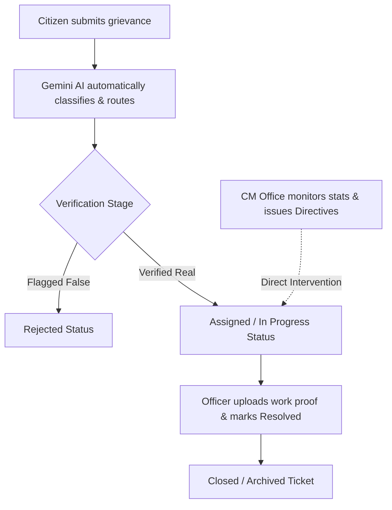

# 🏛️ Delhi Samadhan Portal
### GovTech Grievance Redressal & Executive Monitoring System

Delhi Samadhan Portal is a premium state-level web application designed to connect citizens, department officers, portal administrators, and the Chief Minister's office. It facilitates automated complaint routing, real-time tracking, cloud-based media validation, and executive choropleth visualization.

---

## 🛠️ Technology Stack

| Component | Technology | Description |
| :--- | :--- | :--- |
| **Frontend** | React (Vite), Vanilla CSS, Tailwind CSS | Sleek, glassmorphic UI supporting interactive dashboards, full responsiveness, and multi-language localization (English & Hindi). |
| **Backend** | Node.js, Express.js | Secure REST API backend with customized Role-Based Access Control (RBAC) middleware. |
| **Database** | MongoDB, Mongoose | Persistent storage of tickets, user accounts, and status history logs. |
| **AI Classifier** | Google Gemini API | Automated semantic routing. Classifies complaint descriptions instantly and routes them to the correct nodal department. |
| **Cloud Storage**| Cloudinary API | Secure cloud storage for citizen media uploads and officer field verification/resolution proof files. |
| **Mapping & GIS**| Leaflet & React Leaflet | Interactive boundary rendering (choropleth) of Delhi's 11 administrative districts shaded dynamically based on active ticket volumes. |

---

## 🔄 System Workflow & Roles



### 👤 User Roles & Access Control
1. **Citizen (Public)**:
   * Submits complaints with image/video attachments.
   * Auto-detects GPS coordinates or selects address landmarks.
   * Tracks grievance progress using a unique token on a dynamic progress bar.
2. **Officer**:
   * Inspects and manages department-specific complaint queues.
   * Updates status (`Assigned` ➔ `In Progress` ➔ `Resolved`).
   * Uploads field photos/videos as verification and resolution proof.
3. **Chief Minister (CM)**:
   * Accesses state-level executive analytics.
   * Views district boundary maps shaded dynamically by volume (Green `0-5`, Yellow `5-8`, Orange `8-10`, Red `>10`).
   * Intervenes directly in delayed cases by issuing official **CM Directives**.
4. **Administrator (Admin)**:
   * Oversees all system metrics and department performance graphs.
   * Force-overrides ticket statuses, manages officer profiles, and adds new accounts.

---

## 🚀 Installation & Setup

### 1. Prerequisites
* **Node.js** (v18+ recommended)
* **MongoDB** (Local instance or MongoDB Atlas cluster)

### 2. Environment Configuration
Create a `.env` file inside the `backend/` directory:
```env
PORT=5000
MONGODB_URI=your_mongodb_connection_string

# Gemini AI Configuration
GEMINI_API_KEY_1=your_gemini_api_key

# Cloudinary Storage Configuration
CLOUDINARY_CLOUD_NAME=your_cloudinary_cloud_name
CLOUDINARY_API_KEY=your_cloudinary_api_key
CLOUDINARY_API_SECRET=your_cloudinary_api_secret

# JWT Secret Token
JWT_SECRET=your_jwt_secret_key
JWT_EXPIRE=7d
```

### 3. Database Seeding
To populate the database with default admin/CM credentials, officer profiles, and initial complaints:
```bash
cd backend
npm run seed
```

### 4. Running the Development Servers
Start the backend server:
```bash
cd backend
node server.js
```

Start the frontend development server:
```bash
cd frontend
npm run dev
```
Open [http://localhost:5173](http://localhost:5173) in your browser.

---

## 🔒 Security & Performance Features
* **Role-Based Guards**: Protected routing ensures users cannot access dashboards outside of their authorized roles.
* **Auto-Resizing Map Canvas**: Integrated Leaflet size invalidation logic to prevent broken maps inside flexible CSS layouts.
* **WGS84 Coordination Optimization**: Localized district coordinates are minified to 5 decimal places to optimize asset bundle loading times.
* **JWT Interceptors**: Automatic bearer token injections on requests, with secure session wipe on `401 Unauthorized` responses.
